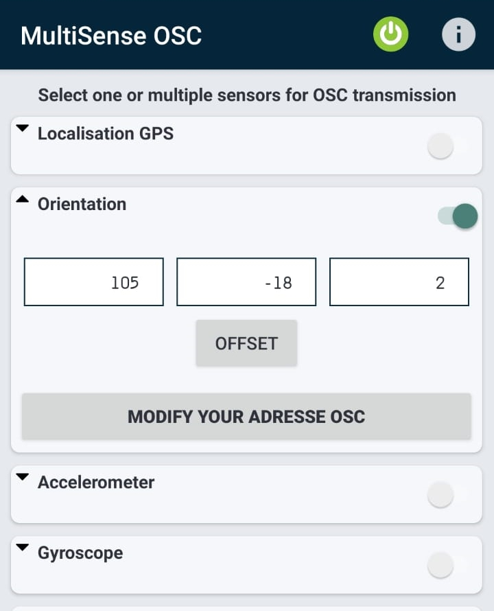

<!-- PROJECT SHIELDS -->
[![Contributors][contributors-shield]][contributors-url]
[![Forks][forks-shield]][forks-url]
[![Stargazers][stars-shield]][stars-url]

<!-- PROJECT LOGO -->
 

  

<h3 align="center">Chordophone Champion</h3>

  

   A complete computer music system with interaction design principles.
     
    <a href=""><strong>Explore the docs»</strong></a>
     
  

<!-- TABLE OF CONTENTS -->

  
Table of Contents

  <ol>
    <li>
      <a href="#about-the-project">About The Project</a>
      <ul>
        <li><a href="#built-with">Built With</a></li>
      </ul>
    </li>
    <li>
      <a href="#getting-started">Getting Started</a>
      <ul>
        <li><a href="#prerequisites">Prerequisites</a></li>
        <li><a href="#installation">Installation</a></li>
        <li><a href="#run">Run the Code</a></li>
        <li><a href="#MultisenseOSC Settings">MultisenseOSC Settings</a></li>
      </ul>
    </li>
    <li><a href="#usage">Usage</a></li>
    <li><a href="#data">Data</a></li>
    <li><a href="#roadmap">Roadmap</a></li>
    <li><a href="#contact">Contact</a></li>

  </ol>

<!-- ABOUT THE PROJECT -->
## About The Project

(<a href="#top">back to top</a>)

### Built With

* [Supercollider](https://supercollider.github.io/)
* [Processing](https://processing.org/)

(<a href="#top">back to top</a>)

<!-- GETTING STARTED -->
## Getting Started

### Prerequisites
You have to download Supercollider and Processing on our PC.
Don't foget also to download the MultiSense OSC application on your smartphone.
### Installation

1. Download for free Supercollider at [https://supercollider.github.io] on your PC
2. Install Supercollider on your PC
3. Download for free Processing at [https://processing.org/download] on your PC
4. Install Processing on your PC
5. Download and install for free MultiSense OSC on your smartphone (Google Play Store link: [https://play.google.com/store/apps/details?id=edu.polytechnique.multisense.release], Apple Store link: [https://apps.apple.com/us/app/gyrosc/id418751595])

### Run
1. Open instruments.sc file with Supercollider and run it
2. Open the ch2.pde file with Processing
3. Accept the following alert that you get after opening the file   
4. In order to solve the error you will find in the import you have to do the next step   
5. Go to Sketch > Import Library > Add Library... It will open the Contribution Manager panel; here you can search and find the missing libraries and then click the install button    
6. Move the data folder inside the ch2 folder
7. Finally click the play button on top for run the code

### MultisenseOSC Settings
## Android
1. Open the MultisenseOSC application on your smartphone.
  2. Insert the IP address of your PC and the port number '12000'; then click NEXT button.
  3. Enable the Orientation in tha main menu of the app.
  4. Click on the Orientation card in order to expand it.
  5. Take the smartphone straight in front of the PC and then click OFFSET button to calibrate the device.
  6. Start the OSC clicking the start button on top.
  7. If you have done everything right you will see the application like this:  .

## iOS
1. Open the GyrOSC application on your smartphone
  2. Insert the 'Target IP Address' of your PC, the port number '12000' and insert computer in the 'Tag' textcell.
  3. Move to the second window from the left (in the bottom bar).
  4. Switch to active the 'Gyroscope' and to not active all the others.
  5. Set the 'Frequency' to 120Hz.
  6. Pick up your phone and keep it paraller to the floor surface and then click the top icon to calibrate the device.
  7. Now back in the first window you will see in the 'Sending' section the following line: /gyrosc/computer/gyro{pitch, roll, yaw}

(<a href="#top">back to top</a>)

<!-- USAGE EXAMPLES -->
## Usage
In the main menu of the application you can choose from a list of songs the one that you'd love to play. 
In the second select you can choose instead the instrument that you prefer for playing the song. 
The last thing that you have to setup is the operative system that you have installed on you smartphone, in order to connect to the application properly. 
Finally you can click the "Start" button and start playing the game!  
  
The usage of the game is pretty simple: the only thing that you are supposted to do is to move up and down your phone in order to control the plectrum. The goal of the player is to center as many time as possible the colored dots that incomes from left to right. You can also notice that every line in the GUI represent a specific note of the song that is played in real time by the application, so when you move up and down with your phone you are simply play a different note of the song that you have chose. 
On top right of the interface you can find also your current score and your combo.  
  
When you have finished to play your favourite song, you can save the data of your last game. For doing this you have only to insert your name in the form that will be displayed after the game has ended and then click the "Submit" button. If you want to play again the game instead you can simply click the "Restart" button.  
  

## Data
The data will be stored in the data folder that in the previous steps you have moved in the ch2 folder. In fact, after saving your games, in this folder you can find a file called "save.dat", in wich you can find the name of the user you inserted, the name of the song and the score that you played; all these informations will be seprated by a semicolon. Here you can find a simple example of the save.dat file structure.  
  
Another important file you can find in the data folder is the "comfig.dat", in wich there are stored all the name of the songs avaiable in the application, combinated with their speed (separeted also this time by a semicolon). So in order to change the speed of the songs you can simply modify this file. Here you can find a simple example of the config.dat file structure.  
  

(<a href="#top">back to top</a>)

<!-- ROADMAP -->
## Roadmap

- [✓] select the song that you want to play
- [✓] select the instrument that you want to play
- [✓] select the OS of your smartphone
- [✓] click start 
- [✓] play the game moving your phone up and down
- [✓] insert your name and submit your score 
- [✓] look your score in the save.dat file
- [✓] change the speed of the songs in the config.dat
- [✓] click restart for playing again and again

(<a href="#top">back to top</a>)

<!-- CONTACT -->
## Contact

Gerardo Cicalese - (gerardo.cicalese@mail.polimi.it) 

Alberto Bollino - (alberto.bollino@mail.polimi.it) 

Umberto Derme - (umberto.derme@mail.polimi.it) 

Giorgio Granello - (giorgio.granello@mail.polimi.it) 

Project Link: 

(<a href="#top">back to top</a>)

<!-- MARKDOWN LINKS & IMAGES -->
<!-- https://www.markdownguide.org/basic-syntax/#reference-style-links -->
[contributors-shield]: https://img.shields.io/github/contributors/polimi-cmls-22/group7-hw-SC-Radical_Geeks.svg?style=for-the-badge
[contributors-url]: https://github.com/polimi-cmls-22/group7-hw-SC-Radical_Geeks/graphs/contributors
[forks-shield]: https://img.shields.io/github/forks/polimi-cmls-22/group7-hw-SC-Radical_Geeks.svg?style=for-the-badge
[forks-url]: https://github.com/polimi-cmls-22/group7-hw-SC-Radical_Geeks/network/members
[stars-shield]: https://img.shields.io/github/stars/polimi-cmls-22/group7-hw-SC-Radical_Geeks.svg?style=for-the-badge
[stars-url]: https://github.com/polimi-cmls-22/group7-hw-SC-Radical_Geeks/stargazers
